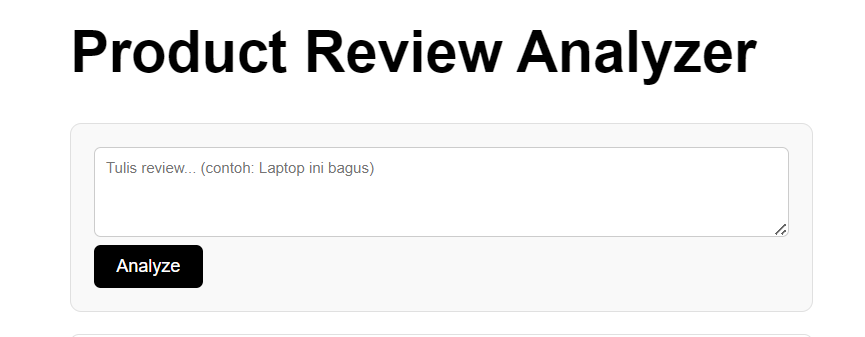

````markdown
# Product Review Analyzer 🚀

Aplikasi web Fullstack untuk menganalisis sentimen ulasan produk secara otomatis menggunakan AI. Proyek ini dibangun untuk mendemonstrasikan integrasi antara React.js, Python Pyramid, dan Modern AI APIs.



## ✨ Fitur Utama
- **Analisis Sentimen Real-time:** Menggunakan model **RoBERTa (Hugging Face)** untuk mendeteksi sentimen Positif/Negatif/Netral.
- **AI Summary:** Menggunakan **Google Gemini 1.5 Flash** untuk meringkas poin pro & kontra dari ulasan panjang.
- **Database History:** Menyimpan riwayat analisis menggunakan **PostgreSQL**.
- **Modern UI:** Antarmuka responsif dengan React & Vite.

## 🛠️ Tech Stack
- **Frontend:** React.js, Vite, Axios, CSS Modules.
- **Backend:** Python 3.x, Pyramid Framework, SQLAlchemy.
- **Database:** PostgreSQL.
- **AI Services:** Google Gemini API & Hugging Face Inference API.

## 🔑 Konfigurasi API Key (PENTING!)
Demi alasan keamanan (**GitHub Push Protection**), **API Key asli tidak disertakan** di dalam repository ini. Agar aplikasi dapat berjalan dengan fitur AI, Anda perlu memasukkan API Key Anda sendiri.

1. Buka file `backend/ai_services.py`.
2. Cari variabel `HF_API_TOKEN` dan `GEMINI_API_KEY` (biasanya di baris atas).
3. Masukkan kunci Anda di sana:
   - **Hugging Face Token:** Dapatkan di [Hugging Face Settings](https://huggingface.co/settings/tokens).
   - **Gemini API Key:** Dapatkan di [Google AI Studio](https://aistudio.google.com/app/apikey).

```python
# Contoh di backend/ai_services.py:
HF_API_TOKEN = "Bearer hf_MASUKKAN_TOKEN_HF_ANDA_DISINI" 
GEMINI_API_KEY = "MASUKKAN_KEY_GEMINI_ANDA_DISINI"
````

## ⚠️ Catatan Penggunaan (API Limits)

Proyek ini menggunakan **Free Tier API** untuk layanan AI.

  - Jika muncul pesan `Quota Exceeded` atau `Error 429`, itu berarti batas kuota harian Google Gemini telah habis.
  - Jika sentimen loading lama, server Hugging Face sedang mengalami "Cold Start". Silakan coba tekan tombol analyze lagi.

## 🚀 Cara Menjalankan (Local)

### 1\. Setup Backend

Buka terminal dan masuk ke folder backend:

```bash
cd backend
python -m venv venv

# Windows:
.\venv\Scripts\activate
# Mac/Linux:
source venv/bin/activate

# Install Library yang dibutuhkan
pip install pyramid waitress sqlalchemy psycopg2-binary requests google-generativeai zope.sqlalchemy transaction

# Jalankan Server
python app.py
```

*Server Backend berjalan di http://localhost:6543*

### 2\. Setup Frontend

Buka terminal baru dan masuk ke folder frontend:

```bash
cd frontend
npm install
npm run dev
```

*Aplikasi Frontend berjalan di http://localhost:5173*

### 3\. Setup Database

Pastikan PostgreSQL sudah berjalan. Buka terminal SQL (`psql`) atau pgAdmin, lalu jalankan:

```sql
CREATE DATABASE review_db;
-- Pastikan password user 'postgres' di app.py sesuai dengan konfigurasi PostgreSQL Anda.
```

-----

**Author:** Romualdus Hary Prabowo (Hypo)

```
```